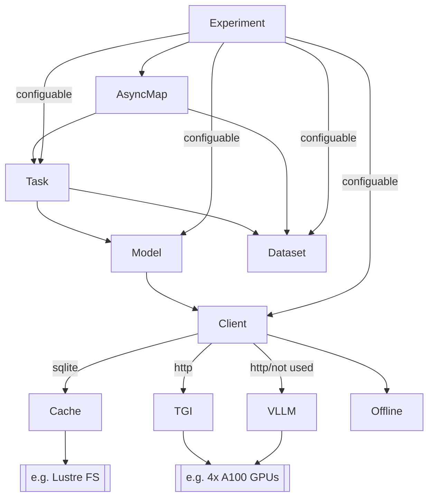

# Are self-explanations from Large Language Models faithful?

This is the code for the paper [_Are self-explanations from Large Language Models faithful?_](https://arxiv.org/abs/2401.07927).

Large language models are increasingly being used by the public, in the form of chat models. These chat systems often provide detailed and highly convincing explanations for their answers, even when not explicitly prompted to do so. This makes users more confident in these models. However, are the explanations true? If not true, this confidence is unsupported which can be dangerous.

We measure the truthfulness (i.e. interpretability-faithfulness) of the explanations that LLMs provide, so called self-explanations. We do so by holding the models accountable to their own explanations, using self-consistency checks. We find that the truthfulness is highly dependent on the model and the specific task. Suggesting we should not have general confidence in these explanations.

## install

This module is not published on PyPi but you can install directly with:

```bash
python -m pip install -e .
```

## API

The module provides the APIs create custom experiments or reuse existing experiments.
As such it's possible to adapt to new models, datasets, or tasks. The API is async.

Docstrings for every class (TGIClient, IMDBDataset, Llama2Model, etc.) are provided
in the source files. For a complete example on how to use these class together,
please see the [./experiments/analysis.py](./experiments/analysis.py) file.

### High level overview of each class



### Short example

```python
import asyncio
import pathlib

from introspect.client import TGIClient
from introspect.dataset import IMDBDataset
from introspect.model import Llama2Model
from introspect.tasks import SentimentCounterfactualTask
from introspect.util import AsyncMap
from introspect.database import GenerationCache

async def main():
    cache = GenerationCache('custom_experiment')
    client = TGIClient('http://127.0.0.1:3000', cache)
    dataset = IMDBDataset(persistent_dir=pathlib.Path('.'))
    model = Llama2Model(client)
    task = SentimentCounterfactualTask(model)
    aggregator = task.make_aggregator()

    async with cache:
        async for answer in AsyncMap(task, dataset.test(), max_tasks=20):
            aggregator.add_answer(answer)

    print(aggregator.results)

if __name__ == '__main__':
    asyncio.run(main())
```

## Experiments

Rather than writing your own code, the experiments from the paper can be run
by using the provided CLI: `python experiments/analysis.py`.

For example:

```bash
python experiments/analysis.py
    --persistent-dir $SCRATCH/introspect
    --endpoint http://127.0.0.1:3000
    --task redacted
    --task-config ''
    --model-name llama2-70b
    --dataset IMDB
    --split test
    --seed 0
```

### Arguments

* `--persistent-dir` controls where data is stored.
* `--endpoint` is the URL to REST API used for inference. By default the TGI client is used,
  however you can specify another client with `--client`.
* `--task` controls the main experiments, either `classify`,
* `counterfactual`, `redacted`, or `importance`.
* `--task-config` allows to use a number of different prompt-variations. Which prompt
  variation is allowed depends on the task.
  * Classify: `c-persona-you`, `c-persona-human`, otherwise objective personal. `m-removed` for the `[REMOVED]` token, otherwise `[REDACTED]`.
  * Counterfactual: `e-persona-you`, `e-persona-human`, otherwise objective personal. `e-implcit-target` for the implicit counterfactual target, otherwise explicit is used.
  * Redacted and Importance: `e-persona-you`, `e-persona-human`, otherwise objective personal. `m-removed` for the `[REMOVED]` token, otherwise `[REDACTED]`.
* `--model-name` specify the model, either `llama2-70b`, `llama2-7b`, `falcon-40b`, `falcon-7b`, `mistral-v1-7b`.
  This is a shorthand that will resolve to the appropiate huggingface repo and model type. You can also specify
  these manually with `--model-id` and `--model-type` respectively.
* `--dataset` is which dataset. Included datasets are `IMDB`, `RTE`, `bAbI-1`, `MCTest`.
* `--split` either `train`, `valid`, or `test`.
* `--seed` the seed used for inference.

## Running on a HPC setup

For downloading the required resources we provide a `experiment/download.py` script

Finally, we provide scripts for submitting all jobs to a Slurm queue, in `jobs/`. The jobs automatically use `#SCRATCH/introspect` as the persistent dir.
